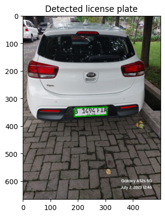

# Deteksi Plat Nomor (Identifikasi & Crop)
#### I Wayan Ardika Chandra (202131009)

### Teori umum
Pengolahan citra (image processing) adalah metode untuk melakukan beberapa operasi pada gambar, untuk mendapatkan gambar yang disempurnakan atau untuk mengekstrak beberapa informasi berguna darinya. Input pada pengolahan citra adalah gambar dan outputnya dapat berupa gambar atau karakteristik/fitur yang terkait dengan gambar tersebut.

Tujuan utama dari pengolahan citra adalah untuk mengubah citra menjadi bentuk digital dan melakukan operasi dengan algoritma tertentu untuk mendapatkan model atau mengekstrak informasi yang berguna pada citra.

Berikut tujuan umun pengolahan citra:

- Visualisasi: menemukan objek yang tidak terlihat pada gambar
- Penajaman dan pemulihan gambar: digunakan untuk resolusi gambar yang lebih baik.
- Pengambilan gambar: mencari gambar dari database gambar digital yang mirip dengan gambar aslinya.
- Pengukuran pola: mengukur berbagai pola di sekitar objek pada gambar
- Pengenalan gambar: setiap objek dalam gambar dapat dibedakan.

Dalam hal ini, Deteksi Plat Nomor (Identifikasi & Crop) adalah proses pengenalan dan ekstraksi plat nomor kendaraan dari sebuah gambar atau video. Tujuan utama dari deteksi plat nomor adalah untuk mengidentifikasi dan memisahkan plat nomor kendaraan dari latar belakang atau lingkungan sekitarnya.

Deteksi gambar melibatkan penggunaan teknik dan algoritma pemrosesan citra untuk mengidentifikasi fitur-fitur yang khas dari objek yang ingin dideteksi. Beberapa metode umum yang digunakan dalam deteksi gambar termasuk:

- Deteksi Tepi: Menggunakan operator tepi seperti operator Sobel atau operator Canny untuk menemukan perubahan tajam dalam intensitas piksel yang menandakan batas objek.
- Segmentasi: Memisahkan objek dari latar belakang dengan teknik thresholding, pemisahan berdasarkan warna, atau metode pemisahan lainnya.
- Deteksi Fitur: Menggunakan teknik ekstraksi fitur untuk mengidentifikasi pola khusus atau fitur-fitur unik dari objek yang ingin dideteksi. Contohnya adalah deteksi wajah menggunakan metode Viola-Jones yang menggunakan fitur Haar-like atau deteksi objek menggunakan fitur HOG (Histogram of Oriented Gradients).
- Penggunaan Klasifikasi: Setelah fitur-fitur ditemukan, algoritma klasifikasi seperti Support Vector Machine (SVM), Jaringan Saraf Tiruan (Neural Networks), atau Random Forest dapat digunakan untuk membedakan objek yang diinginkan dari objek lainnya.

### Tahapan Penyelesaian Project
Pada tahap development deteksi plat nomor, berikut ini adalah beberapa metode umum yang digunakan dalam deteksi plat nomor:

- Pemrosesan Citra: Pemrosesan citra digunakan untuk mengubah gambar asli menjadi representasi yang lebih cocok untuk analisis lebih lanjut. Tahap ini meliputi konversi ke skala keabuan, pemulusan, segmentasi, dan penekanan fitur.

- Segmentasi: Segmentasi adalah proses memisahkan plat nomor dari latar belakang atau lingkungan sekitarnya. Metode yang umum digunakan termasuk thresholding, pemisahan berdasarkan warna, deteksi tepi, dan pemisahan berdasarkan tekstur.

- Deteksi Tepi: Deteksi tepi digunakan untuk menemukan perubahan tajam dalam intensitas piksel pada gambar. Metode seperti operator Sobel, operator Canny, atau operator Prewitt dapat digunakan untuk mengidentifikasi tepi pada gambar.

- Transformasi Geometri: Transformasi geometri, seperti transformasi perspektif atau transformasi affine, digunakan untuk memperbaiki perspektif dan memperoleh pandangan plat nomor kendaraan yang lurus.

- Pengklasifikasi: Setelah plat nomor terisolasi, tahap pengklasifikasi digunakan untuk mengenali karakter pada plat nomor. Algoritma pengklasifikasi seperti metode template matching, metode pembelajaran mesin (machine learning), atau penggunaan Optical Character Recognition (OCR) dapat digunakan untuk mengenali karakter pada plat nomor.

- Cropping: Setelah karakter pada plat nomor teridentifikasi, proses cropping digunakan untuk memotong dan memisahkan karakter-karakter tersebut dari plat nomor secara individu. Hal ini memudahkan dalam proses pengenalan karakter lebih lanjut.

---

### Beberapa Penjelasan Potongan Source Code terkait

import numpy as np

import cv2

import matplotlib.pyplot as plt

import imutils

Merupakan impor library yang dibutuhkan untuk bekerja dengan gambar dan melakukan operasi pengolahan gambar.

---

#### Read the image file

image = cv2.imread('images/asset.jpg')

plt.imshow(cv2.cvtColor(image, cv2.COLOR_BGR2RGB))

plt.title('Original Image')

plt.show()

untuk membaca file gambar dan menampilkan gambar dan menampilkan menggunakan matplotlib

---

#### Image processing and edge detection performing

Berikut adalah penjelasan singkat dari setiap langkahnya:

1. image = imutils.resize(image, width=500): Mengubah ukuran gambar menjadi lebar sebesar 500 piksel menggunakan modul imutils.

2. img=cv2.cvtColor(image, cv2.COLOR_BGR2RGB): Mengubah mode warna gambar dari BGR (Blue-Green-Red) menjadi RGB (Red-Green-Blue) menggunakan fungsi cv2.cvtColor.

3. Menampilkan gambar asli dan gambar dalam skala keabuan (grayscale) menggunakan Matplotlib:

4. fig, ax = plt.subplots(2, 2, figsize=(10,7)): Membuat sebuah objek gambar dengan 2 baris dan 2 kolom untuk menampilkan empat gambar.

- ax[0,0].imshow(cv2.cvtColor(image, cv2.COLOR_BGR2RGB)): Menampilkan gambar asli di posisi baris pertama, kolom pertama.

- ax[0,1].imshow(gray, cmap='gray'): Menampilkan gambar dalam skala keabuan di posisi baris pertama, kolom kedua.

- ax[1,0].imshow(gray, cmap='gray'): Menampilkan hasil filter bilateral pada gambar dalam skala keabuan di posisi baris kedua, kolom pertama.

- ax[1,1].imshow(edged, cmap='gray'): Menampilkan tepi Canny pada gambar dalam skala keabuan di posisi baris kedua, kolom kedua.

5. gray = cv2.cvtColor(image, cv2.COLOR_BGR2GRAY): Mengonversi gambar asli ke dalam skala keabuan menggunakan fungsi cv2.cvtColor.

6. gray = cv2.bilateralFilter(gray, 11, 17, 17): Menghilangkan noise pada gambar menggunakan filter bilateral dengan parameter yang ditentukan.

7. edged = cv2.Canny(gray, 200, 400): Mencari tepi pada gambar skala keabuan menggunakan metode Canny dengan nilai ambang batas yang ditentukan.

8. cnts = cv2.findContours(edged.copy(), cv2.RETR_LIST, cv2.CHAIN_APPROX_SIMPLE)[0]: Menemukan kontur-kontur pada gambar tepi menggunakan fungsi cv2.findContours.

9. cnts=sorted(cnts, key = cv2.contourArea, reverse = True)[:30]: Mengurutkan kontur-kontur berdasarkan luasnya secara menurun dan mengambil 30 kontur terbesar.

Mencari kontur dengan 4 sudut yang merupakan kontur yang kemungkinan merupakan plat nomor:

10. for c in cnts:

11. peri = cv2.arcLength(c, True): Menghitung panjang lengkung kontur.

12. approx = cv2.approxPolyDP(c, 0.02 * peri, True): Mengaproksimasi kontur dengan jumlah sudut yang lebih sedikit.

13. if len(approx) == 4:
Jika kontur memiliki 4 sudut, maka dianggap sebagai kontur plat nomor yang diinginkan.

14. NumberPlateCnt = approx: Menyimpan kontur plat nomor yang dianggap terbaik.

15. x,y,w,h = cv2.boundingRect(c): Mendapatkan koordinat dan ukuran kotak pembatas (bounding box) dari kontur yang terpilih.

16. ROI = img[y:y+h, x:x+w]: Memotong area gambar asli yang sesuai dengan kotak pembatas plat nomor.

17. Jika NumberPlateCnt tidak kosong (artinya ditemukan kontur plat nomor):
cv2.drawContours(image, [NumberPlateCnt], -1, (0,150,0), 3): Menggambar kontur plat nomor pada gambar asli menggunakan fungsi cv2.drawContours.

#### Detected Plate
plt.imshow(cv2.cvtColor(image, cv2.COLOR_BGR2RGB))

plt.title("Detected license plate")

plt.show()

menampilkan gambar asli yang telah diproses dan diubah mode warnanya menjadi RGB dengan menggunakan fungsi cv2.cvtColor. Kemudian, gambar tersebut ditampilkan menggunakan Matplotlib dengan plt.imshow().

Selanjutnya, judul atau teks "Detected license plate" ditambahkan menggunakan plt.title() untuk memberi informasi tentang konten gambar yang ditampilkan. Akhirnya, gambar ditampilkan dengan plt.show() untuk menampilkan gambar asli yang telah diproses dengan kontur plat nomor yang terdeteksi.

#### ROI Image Crop

plt.imshow(ROI)

plt.title("Extracted license plate")

plt.show()

Code di atas bertujuan untuk menampilkan gambar yang merupakan region of interest (ROI) dari plat nomor kendaraan yang telah diextract. Gambar tersebut ditampilkan menggunakan plt.imshow() dengan menggunakan ROI sebagai input gambar.

#### Perubahan ke bentuk Binary and edges
gray_roi = cv2.cvtColor(ROI, cv2.COLOR_BGR2GRAY)

_, binary_roi = cv2.threshold(gray_roi, 130, 255, cv2.THRESH_BINARY)

edges_roi = cv2.Canny(gray_roi, 30, 50)

fig, ax = plt.subplots(1, 2, figsize=(10, 5))
ax[0].imshow(binary_roi, cmap='gray')
ax[0].set_title('Binary ROI')
ax[0].axis('off')

ax[1].imshow(edges_roi, cmap='gray')
ax[1].set_title('Edges ROI')
ax[1].axis('off')
plt.tight_layout()
plt.show()

code di atas bertujuan untuk mengubah gambar ke bentuk binary dan edges setelah di crop kemudian ditampilkan hasilnya

